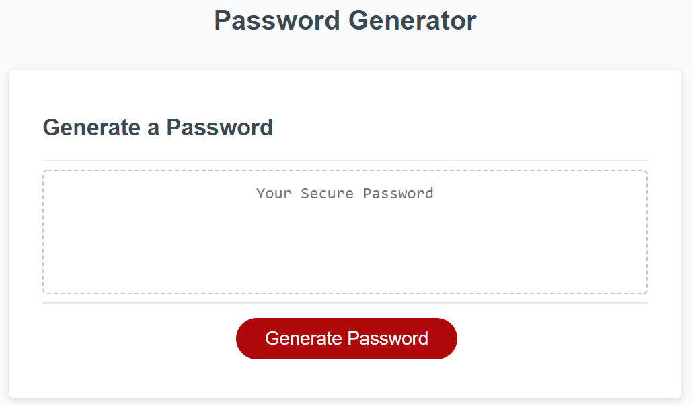
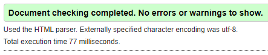

# Password Generator

## Customer Request

For this project the customer request we

1. Build a Random Password Generator that the user can create a strong password that provides greater security:

- Pick a number between 8 thru 128 characters long
- Ask if they want to use `CAPITAL` Case Letters
- Ask if they want to use `lower` Case Letters
- Ask if they want to use `Numbers`
- Ask if they want to use `Special Characters`

---

## Site

- Use the base site provided below & bring push output to the `Your Secure Password` box

### HTML `|` [**Password Generator**](https://michellemcconville.github.io/03-password-generator/)

- Used the html provided and changed the following:
  - Changed `href="style.css"` to `href="./styles/style.css"` on line #8
  - Changed `src="script.js"` to `src="./scripts/script.js"` on line #32

### CSS

- No changes made to the provided `style.css` file

---

## Sources Referenced

[w3schools](https://www.w3schools.com/html/html5_semantic_elements.asp) `|`
[MDN web docs](https://developer.mozilla.org/en-US/) `|`
[Markdown Guide](https://www.markdownguide.org/) `|`
[google](https://www.google.com/) `|`

---

## Accessibility Standards Validation

Successfully ran code thru [W3C](https://validator.w3.org/) validator

---

## Output for Review

Submitted the following for review:

- The URL of the deployed application
- The URL of the GitHub repository. (**README.md** included)

---
.
