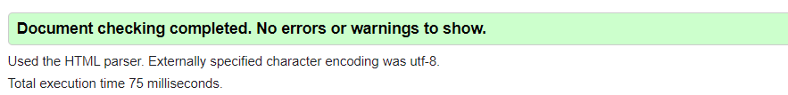

# Password Generator

## Customer Request

For this project the customer request we:

Build a `Random Password Generator` where the user can create a strong password which will provide greater security:

- Pick a number between 8 thru 128 characters long
- Ask if they want to use `CAPITAL` Case Letters
- Ask if they want to use `lower` Case Letters
- Ask if they want to use `Numbers`
- Ask if they want to use `Special Characters`

---

## Site

- Uses the base site provided below & push created output to the `Your Secure Password` box

### HTML `|` [**Password Generator**](https://michellemcconville.github.io/03-password-generator/)

- Used the `index.html` provided & changed the following:
  - Changed `href="style.css"` to `href="./styles/style.css"` on line #8
  - Changed `src="script.js"` to `src="./scripts/script.js"` on line #32

### CSS

- No changes made to the provided `style.css` file

### JS

- Newly created `script.js` file with the following:
  - Multiple `arrays` containing the available PW `elements`
  - A writePassword() `function`:
    - Sets a `var` equal to the generatePassword() `function`
    - Calls the generatePassword() `function`
    - Then returns the generatePassword() `function` `value` & sets a new `var`
  - The 2nd `function` called generatePassword()
    - Creates new `var` for combined `array`
    - `Prompts` the user for a PW length
    - Validates the above `prompt` for valid response
    - `Prompts` the user w/ questions on PW characters
    - Validates at least 1 above `prompt` was selected as `true`
    - `Concatenates` `arrays` based on `prompts`
    - A `loop` which generates a `random` character string by the  PW length given
  - `Returns` the `New Password`
  - Adds a `click` event for the Generate Password `Button`

---

## Sources Referenced

[w3schools](https://www.w3schools.com/) `|`
[MDN web docs](https://developer.mozilla.org/en-US/) `|`
[Markdown Guide](https://www.markdownguide.org/) `|`
[google](https://www.google.com/)

---

## Accessibility Standards Validation

Successfully ran code thru [W3C](https://validator.w3.org/) validator

---

## Output for Review

Submitted the following for review:

- The URL of the deployed application
- The URL of the GitHub repository. (**README.md** included)

---
